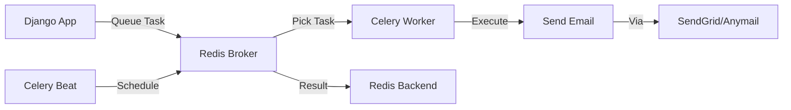

# Celery Email Automation Guide

## Overview

ProjectMeats uses Celery for asynchronous task processing, particularly for sending invitation emails and running scheduled maintenance tasks. This guide covers the setup, usage, and testing of the Celery integration.

## Architecture



## Components

### 1. Redis (Broker + Result Backend)
- **Purpose**: Message broker for task queue and result storage
- **Port**: 6379
- **Connection**: `redis://redis:6379/0` (in Docker)

### 2. Celery Worker
- **Purpose**: Executes asynchronous tasks
- **Command**: `celery -A projectmeats worker -l info`
- **Auto-discovery**: Automatically finds tasks in `tasks.py` files

### 3. Celery Beat
- **Purpose**: Scheduler for periodic tasks
- **Command**: `celery -A projectmeats beat -l info`
- **Scheduler**: Uses Django database backend for persistence

### 4. Django-Anymail
- **Purpose**: Email backend for SendGrid and other providers
- **Configuration**: Via `SENDGRID_API_KEY` environment variable

## Setup

### Local Development

1. **Start Services**:
   ```bash
   docker-compose up -d redis
   ```

2. **Run Migrations**:
   ```bash
   python manage.py migrate
   ```

3. **Start Celery Worker** (in separate terminal):
   ```bash
   celery -A projectmeats worker -l info
   ```

4. **Start Celery Beat** (optional, for periodic tasks):
   ```bash
   celery -A projectmeats beat -l info
   ```

### Production (Docker Compose)

All services start automatically:
```bash
docker-compose up -d
```

Services:
- `backend` - Django application
- `celery` - Celery worker
- `celery-beat` - Celery scheduler
- `redis` - Redis broker

## Environment Variables

### Required

```bash
# Redis connection
REDIS_URL=redis://redis:6379/0

# Email backend (production)
EMAIL_BACKEND=anymail.backends.sendgrid.EmailBackend
SENDGRID_API_KEY=your_sendgrid_api_key

# Email settings
DEFAULT_FROM_EMAIL=noreply@projectmeats.com
SERVER_EMAIL=noreply@projectmeats.com

# Frontend URL for invitation links
FRONTEND_URL=https://app.projectmeats.com
```

### Optional (Development)

```bash
# Use console email backend for development
EMAIL_BACKEND=django.core.mail.backends.console.EmailBackend
```

## Usage

### Sending Invitation Emails

#### Synchronous (Testing)
```python
from apps.tenants.tasks import send_invitation_email

# Send immediately (for testing)
result = send_invitation_email(invitation_id)
```

#### Asynchronous (Production)
```python
from apps.tenants.tasks import send_invitation_email

# Queue task for background execution
task = send_invitation_email.delay(invitation_id)

# Check task status
task_id = task.id
result = task.get(timeout=10)  # Wait up to 10 seconds for result
```

#### Bulk Invitations
```python
from apps.tenants.tasks import send_bulk_invitations

# Send multiple invitations
invitation_ids = [inv1.id, inv2.id, inv3.id]
result = send_bulk_invitations.delay(invitation_ids)
```

### Periodic Tasks

Configured in `projectmeats/celery.py`:

```python
app.conf.beat_schedule = {
    'cleanup-expired-invitations': {
        'task': 'apps.tenants.tasks.cleanup_expired_invitations',
        'schedule': crontab(hour=2, minute=0),  # Daily at 2 AM
    },
}
```

To add new periodic tasks:
1. Define the task in `apps/tenants/tasks.py`
2. Add schedule entry in `projectmeats/celery.py`
3. Restart Celery Beat

## Task Definitions

### send_invitation_email

Sends a tenant invitation email asynchronously.

**Parameters:**
- `invitation_id` (UUID): ID of the TenantInvitation

**Returns:**
- `dict`: Status information

**Retry Policy:**
- Max retries: 3
- Delay: 60 seconds between retries

**Example:**
```python
from apps.tenants.tasks import send_invitation_email

# Queue task
task = send_invitation_email.delay(invitation.id)

# Result will be:
# {'status': 'success', 'email': 'user@example.com', 'invitation_id': '...'}
# or
# {'status': 'skipped', 'reason': 'Invitation is not active'}
```

### cleanup_expired_invitations

Periodic task to deactivate expired invitations.

**Schedule:** Daily at 2:00 AM UTC

**Returns:**
- `dict`: Count of cleaned up invitations

**Example:**
```python
from apps.tenants.tasks import cleanup_expired_invitations

# Manual execution
result = cleanup_expired_invitations()
# {'status': 'success', 'count': 5}
```

### send_bulk_invitations

Queues multiple invitation emails for sending.

**Parameters:**
- `invitation_ids` (list): List of invitation IDs

**Returns:**
- `dict`: Summary of queued tasks

**Example:**
```python
from apps.tenants.tasks import send_bulk_invitations

invitation_ids = [inv1.id, inv2.id, inv3.id]
result = send_bulk_invitations.delay(invitation_ids)
# {'success': 3, 'failed': 0, 'skipped': 0, 'errors': []}
```

## Testing

### Unit Tests

Located in `apps/tenants/tests_email_tasks.py`:

```bash
# Run all email task tests
python manage.py test apps.tenants.tests_email_tasks

# Run specific test
python manage.py test apps.tenants.tests_email_tasks.InvitationEmailTaskTestCase.test_send_invitation_email_success
```

### Integration Tests

Test with real SendGrid API (requires API key):

```bash
# Set environment variable
export SENDGRID_API_KEY=your_test_api_key
export EMAIL_BACKEND=anymail.backends.sendgrid.EmailBackend

# Run tests
python manage.py test apps.tenants.tests_email_tasks
```

### Manual Testing

```python
# In Django shell
python manage.py shell

from apps.tenants.models import Tenant, TenantInvitation
from apps.tenants.tasks import send_invitation_email

# Create test tenant and invitation
tenant = Tenant.objects.first()
invitation = TenantInvitation.objects.create(
    tenant=tenant,
    email='test@example.com',
    role='member',
)

# Send email asynchronously
task = send_invitation_email.delay(invitation.id)

# Check result
result = task.get(timeout=10)
print(result)
```

## Monitoring

### Celery Worker Status

```bash
# Check worker status
celery -A projectmeats inspect active

# Check registered tasks
celery -A projectmeats inspect registered

# Check scheduled tasks
celery -A projectmeats inspect scheduled
```

### Redis Monitoring

```bash
# Connect to Redis CLI
redis-cli

# Check queue length
LLEN celery

# Monitor real-time commands
MONITOR
```

### Django Admin

Celery Beat schedules can be managed via Django Admin:
- URL: `/admin/django_celery_beat/`
- Manage periodic tasks, schedules, and intervals

## Error Handling

### Task Failures

Tasks automatically retry on failure (up to 3 times by default):

```python
@shared_task(bind=True, max_retries=3, default_retry_delay=60)
def send_invitation_email(self, invitation_id):
    try:
        # Task logic
        pass
    except Exception as exc:
        # Retry with exponential backoff
        raise self.retry(exc=exc)
```

### Email Failures

Check logs for email sending errors:

```bash
# View Celery worker logs
docker logs projectmeats-celery

# Filter for errors
docker logs projectmeats-celery | grep ERROR
```

## Performance Tuning

### Worker Concurrency

```bash
# Increase worker processes
celery -A projectmeats worker -l info --concurrency=4

# Use autoscale
celery -A projectmeats worker -l info --autoscale=10,3
```

### Task Priorities

```python
# High priority task
send_invitation_email.apply_async(
    args=[invitation_id],
    priority=9  # 0-9, higher is more priority
)
```

### Rate Limiting

```python
@shared_task(rate_limit='10/m')  # 10 tasks per minute
def send_invitation_email(invitation_id):
    pass
```

## Troubleshooting

### Tasks Not Executing

1. Check Redis is running:
   ```bash
   docker ps | grep redis
   ```

2. Check Celery worker is running:
   ```bash
   docker ps | grep celery
   ```

3. Check Redis connection:
   ```python
   from celery import current_app
   current_app.broker_connection().ensure_connection(max_retries=3)
   ```

### Emails Not Sending

1. Check email backend configuration
2. Verify SendGrid API key is set
3. Check Celery worker logs for errors
4. Test SendGrid API key manually:
   ```bash
   curl --request POST \
     --url https://api.sendgrid.com/v3/mail/send \
     --header "Authorization: Bearer $SENDGRID_API_KEY" \
     --header 'Content-Type: application/json' \
     --data '{"personalizations":[{"to":[{"email":"test@example.com"}]}],"from":{"email":"from@example.com"},"subject":"Test","content":[{"type":"text/plain","value":"Test"}]}'
   ```

### Beat Not Scheduling

1. Check Celery Beat is running
2. Verify database migrations are applied
3. Check Beat schedule in Django Admin
4. Restart Beat after schedule changes

## Best Practices

1. **Always use `.delay()` in production** - Queue tasks asynchronously
2. **Add timeouts** - Use `task.get(timeout=X)` to avoid blocking forever
3. **Monitor queue length** - Prevent queue buildup
4. **Use retries** - Handle transient failures gracefully
5. **Log task execution** - Use structured logging for debugging
6. **Test thoroughly** - Use `CELERY_TASK_ALWAYS_EAGER=True` in tests
7. **Set task time limits** - Prevent runaway tasks
8. **Use idempotent tasks** - Tasks should be safe to retry

## Security

1. **Protect Redis** - Use password authentication in production
2. **Secure SendGrid API keys** - Store in environment variables, never in code
3. **Validate email addresses** - Check format before sending
4. **Rate limit sends** - Prevent abuse and API quota exhaustion
5. **Use HTTPS** - For invitation links and frontend URLs

## References

- [Celery Documentation](https://docs.celeryproject.org/)
- [Django-Celery-Beat](https://django-celery-beat.readthedocs.io/)
- [Django-Anymail](https://anymail.readthedocs.io/)
- [SendGrid API](https://sendgrid.com/docs/api-reference/)
