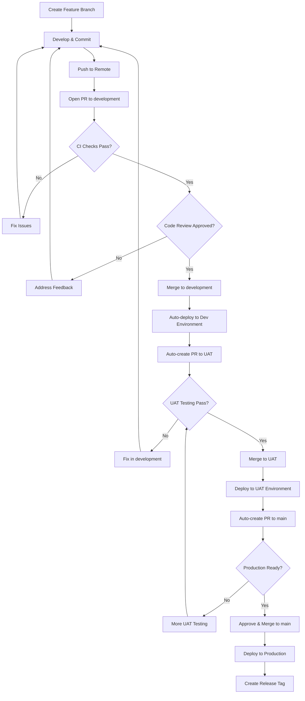
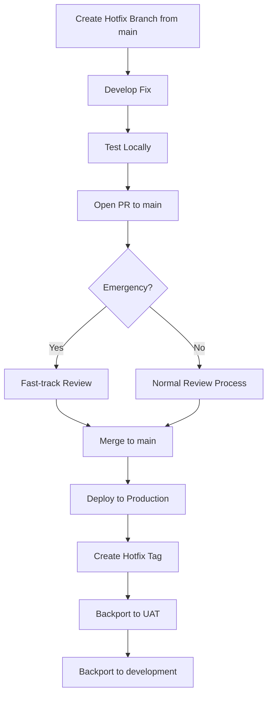

# Branch Workflow Checklist - ProjectMeats

This document provides a comprehensive guide to our branch management, naming conventions, and promotion workflow following industry best practices.

## 📋 Table of Contents

- [Branch Structure](#branch-structure)
- [Branch Naming Conventions](#branch-naming-conventions)
- [Workflow Diagrams](#workflow-diagrams)
- [Step-by-Step Workflows](#step-by-step-workflows)
- [Tagging & Release Process](#tagging--release-process)
- [Automated Validations](#automated-validations)
- [Best Practices](#best-practices)

---

## 🌳 Branch Structure

ProjectMeats uses a three-tier branch structure for environment promotion:

```
┌─────────────────────────────────────────────────────────┐
│                    main (Production)                     │
│  ✓ Production-ready code                                │
│  ✓ Tagged releases (v1.0.0, v2.0.0, etc.)              │
│  ✓ Protected: Requires approval, passing CI             │
└─────────────────────────────────────────────────────────┘
                        ↑
                    Promote from UAT
                        │
┌─────────────────────────────────────────────────────────┐
│                    uat (User Acceptance Testing)         │
│  ✓ Code tested and reviewed in development             │
│  ✓ Pre-release testing environment                     │
│  ✓ Protected: Requires CI passing                      │
└─────────────────────────────────────────────────────────┘
                        ↑
                    Promote from development
                        │
┌─────────────────────────────────────────────────────────┐
│                    development (Active Development)      │
│  ✓ All features/fixes/experiments start here           │
│  ✓ Integration testing                                 │
│  ✓ Protected: Requires PR and CI passing               │
└─────────────────────────────────────────────────────────┘
                        ↑
                Merge feature branches
                        │
        ┌───────────────┴───────────────┐
        │                               │
    feature/*                       fix/*
    refactor/*                   hotfix/*
    chore/*                       etc.
```

### Branch Descriptions

| Branch | Purpose | Deployment Target | Protection Level |
|--------|---------|-------------------|------------------|
| `main` | Production-ready code | Production (DigitalOcean) | Highest - Requires approval + all CI checks |
| `uat` | UAT/Staging environment | UAT (DigitalOcean) | High - Requires all CI checks |
| `development` | Active development | Dev (DigitalOcean) | Medium - Requires PR + CI checks |
| Feature branches | Work in progress | Local/Dev (optional) | None - Personal branches |

---

## 🏷️ Branch Naming Conventions

All feature branches **must** follow this pattern:

```
<type>/<description>
```

### Valid Types

| Type | Purpose | Example |
|------|---------|---------|
| `feature/` | New features or enhancements | `feature/add-customer-portal` |
| `fix/` | Bug fixes | `fix/login-validation-error` |
| `chore/` | Tooling, infrastructure, or CI maintenance | `chore/update-dependencies` |
| `refactor/` | Code refactoring (no functional changes) | `refactor/payment-service` |
| `hotfix/` | Emergency production fixes | `hotfix/security-patch` |
| `docs/` | Documentation-only changes | `docs/update-api-guide` |
| `test/` | Test-related changes | `test/add-integration-tests` |
| `perf/` | Performance improvements | `perf/optimize-database-queries` |
| `ci/` | CI/CD changes | `ci/update-workflow` |
| `build/` | Build system changes | `build/webpack-config` |
| `revert/` | Revert previous changes | `revert/bad-deployment` |
| `copilot/` | GitHub Copilot automated changes | `copilot/auto-fix-123` |

### Description Guidelines

- **Use lowercase** letters only
- **Use hyphens** to separate words (no underscores or spaces)
- **Be concise** but descriptive (3-5 words ideal)
- **Avoid** generic names like `feature/update` or `fix/bug`

### ✅ Valid Examples

```bash
feature/add-customer-export
fix/resolve-token-expiration
chore/update-python-dependencies
refactor/simplify-payment-logic
hotfix/critical-security-patch
docs/update-deployment-guide
test/add-unit-tests-auth
perf/optimize-query-performance
```

### ❌ Invalid Examples

```bash
add-customer-export          # Missing type prefix
Feature/AddCustomerExport    # Should be lowercase
feature/add_customer_export  # Use hyphens, not underscores
feature/fix                  # Too generic
FEATURE/test                 # Should be lowercase
feature-add-export          # Missing slash after type
```

---

## 📊 Workflow Diagrams

### Feature Development Workflow



### Hotfix Workflow



---

## 🔄 Step-by-Step Workflows

### Creating a New Feature

#### Step 1: Create Feature Branch from development

```bash
# Ensure you're on the latest development branch
git checkout development
git pull origin development

# Create your feature branch
git checkout -b feature/your-feature-name
```

#### Step 2: Develop Your Feature

```bash
# Make changes to your code
# Write tests for your changes

# Commit frequently with good commit messages
git add .
git commit -m "feat(scope): add feature description"

# Push to remote regularly
git push origin feature/your-feature-name
```

#### Step 3: Open Pull Request

1. Go to GitHub repository
2. Click "New Pull Request"
3. Set base branch: `development`
4. Set compare branch: `feature/your-feature-name`
5. Fill out PR template completely
6. Ensure PR title follows conventional commits format:
   ```
   feat(scope): description
   ```
7. Request reviewers
8. Wait for CI checks to pass

#### Step 4: Code Review & Merge

1. Address review feedback
2. Ensure all CI checks pass
3. Get approval from reviewers
4. Merge PR (squash and merge recommended)
5. Delete feature branch

#### Step 5: Verify Development Deployment

1. Check auto-deployment to Dev environment
2. Verify feature works in Dev
3. Monitor auto-created PR to UAT

### Promoting to UAT

This is **automated** via GitHub Actions!

When code is merged to `development`:
1. Auto-deployment to Dev environment triggers
2. Workflow creates PR from `development` to `uat`
3. PR requires:
   - All CI checks passing
   - Manual review and approval
4. After approval and merge:
   - Auto-deployment to UAT environment
   - Workflow creates PR from `uat` to `main`

### Promoting to Production

When code is ready in UAT:
1. Review auto-created PR from `uat` to `main`
2. Verify all UAT testing is complete
3. Ensure all CI checks pass
4. Get required approvals
5. Merge to `main`
6. Auto-deployment to Production triggers
7. Create release tag (see Tagging section)

### Creating a Hotfix

#### Step 1: Create Hotfix Branch from main

```bash
# Get latest production code
git checkout main
git pull origin main

# Create hotfix branch
git checkout -b hotfix/critical-issue-name
```

#### Step 2: Develop and Test Fix

```bash
# Make minimal changes to fix the issue
# Test thoroughly locally

# Commit the fix
git add .
git commit -m "hotfix(scope): fix critical issue"

# Push to remote
git push origin hotfix/critical-issue-name
```

#### Step 3: Create PR to main

1. Open PR to `main` (not development!)
2. Mark as urgent/hotfix
3. Request emergency review
4. Ensure CI passes
5. Get quick approval
6. Merge to main

#### Step 4: Deploy and Backport

```bash
# After merge to main, deployment triggers automatically

# Create hotfix tag
git checkout main
git pull origin main
git tag -a v1.0.1 -m "Hotfix: critical issue"
git push origin v1.0.1

# Backport to UAT
git checkout uat
git pull origin uat
git merge main
git push origin uat

# Backport to development
git checkout development
git pull origin development
git merge main
git push origin development
```

---

## 🏷️ Tagging & Release Process

### Semantic Versioning

We follow [Semantic Versioning](https://semver.org/): `vMAJOR.MINOR.PATCH`

- **MAJOR**: Breaking changes (v2.0.0)
- **MINOR**: New features, backward-compatible (v1.1.0)
- **PATCH**: Bug fixes, backward-compatible (v1.0.1)

### Tag Formats

#### Production Releases (on main branch)

```bash
# Format: vMAJOR.MINOR.PATCH
git tag -a v1.0.0 -m "Release v1.0.0: Initial production release"
git tag -a v1.1.0 -m "Release v1.1.0: Add customer portal"
git tag -a v2.0.0 -m "Release v2.0.0: API v2 with breaking changes"
```

#### Pre-Release Tags (for testing)

```bash
# Alpha releases
git tag -a v1.0.0-alpha.1 -m "Alpha release for initial testing"

# Beta releases
git tag -a v1.0.0-beta.1 -m "Beta release for wider testing"

# Release candidates
git tag -a v1.0.0-rc.1 -m "Release candidate 1"
```

#### Environment Tags

```bash
# Development environment
git tag -a v1.0.0-dev -m "Development environment release"

# UAT environment
git tag -a v1.0.0-uat -m "UAT environment release"
```

### Creating a Release

#### Step 1: Ensure Code is in main

```bash
git checkout main
git pull origin main
```

#### Step 2: Create Annotated Tag

```bash
# For a new minor version
git tag -a v1.1.0 -m "Release v1.1.0

- Add customer export functionality
- Improve authentication flow
- Fix critical bugs

See CHANGELOG.md for full details"
```

#### Step 3: Push Tag

```bash
git push origin v1.1.0
```

#### Step 4: Verify Tag Validation

- Tag validation workflow runs automatically
- GitHub Release is auto-created for production tags
- Verify release notes and assets

#### Step 5: Update CHANGELOG

```markdown
## [1.1.0] - 2024-11-03

### Added
- Customer export functionality with CSV and Excel formats
- Enhanced authentication flow with token refresh

### Fixed
- Critical security vulnerability in authentication
- Performance issues with large datasets

### Changed
- Updated UI for better user experience
```

---

## 🔒 Automated Validations

ProjectMeats has automated workflows to enforce naming conventions:

### 1. Branch Name Validation

**Workflow**: `.github/workflows/validate-branch-name.yml`

**Triggers**: On PR open, edit, or sync

**Validates**:
- Branch name follows `<type>/<description>` format
- Type is from approved list
- Description uses lowercase and hyphens only

**On Failure**: Posts comment on PR with helpful guidance

### 2. PR Title Validation

**Workflow**: `.github/workflows/validate-pr-title.yml`

**Triggers**: On PR open, edit, or sync

**Validates**:
- PR title follows Conventional Commits format
- Format: `<type>(<scope>): <description>` or `<type>: <description>`
- Type is from approved list
- Description is lowercase

**On Failure**: Posts comment on PR with examples

### 3. Tag Name Validation

**Workflow**: `.github/workflows/validate-tag-name.yml`

**Triggers**: On tag push

**Validates**:
- Tag follows semantic versioning (v1.0.0)
- Pre-release tags are properly formatted (v1.0.0-alpha.1)
- Environment tags are valid (v1.0.0-dev)

**On Success**: Auto-creates GitHub Release for production tags

---

## ✅ Best Practices

### Branch Management

1. **Never work directly in protected branches** (`main`, `uat`, `development`)
2. **Keep branches short-lived** (< 2 weeks ideal)
3. **Sync with development regularly** to avoid merge conflicts
4. **Delete branches after merge** (automated cleanup runs weekly)
5. **One feature per branch** - don't mix unrelated changes

### Pull Requests

1. **Fill out PR template completely**
2. **Keep PRs focused and small** (< 400 lines changed ideal)
3. **Request reviews from appropriate team members**
4. **Respond to feedback promptly**
5. **Ensure all CI checks pass before requesting review**
6. **Use "Squash and Merge" for cleaner history**

### Commits

1. **Use conventional commit messages**:
   ```
   feat(customers): add export functionality
   fix(auth): resolve token expiration
   docs(api): update authentication guide
   ```
2. **Commit frequently** with logical chunks
3. **Write descriptive commit messages**
4. **Avoid committing secrets or sensitive data**
5. **Run tests before committing**

### Tags and Releases

1. **Only tag in main branch** (production releases)
2. **Use annotated tags** with detailed messages
3. **Follow semantic versioning strictly**
4. **Update CHANGELOG.md** with each release
5. **Include migration notes** for breaking changes

### Code Review

1. **Review within 24 hours** when requested
2. **Test changes locally** for complex features
3. **Check for security issues**
4. **Verify test coverage**
5. **Be constructive and kind** in feedback

---

## 🚨 Common Issues & Solutions

### Issue: Branch name validation fails

**Solution**: Rename your branch to follow conventions
```bash
# Create new branch with correct name
git checkout -b feature/correct-name

# Cherry-pick commits from old branch
git cherry-pick old-branch-commit-hash

# Delete old branch
git branch -D old-branch-name
```

### Issue: PR title validation fails

**Solution**: Edit PR title on GitHub to follow Conventional Commits format

### Issue: Merge conflicts when promoting

**Solution**: 
```bash
# Update your branch with latest from target
git checkout your-branch
git fetch origin
git merge origin/development

# Resolve conflicts
# ... edit files ...

git add .
git commit -m "resolve merge conflicts"
git push origin your-branch
```

### Issue: Tag already exists

**Solution**:
```bash
# Delete local tag
git tag -d v1.0.0

# Delete remote tag (use with caution!)
git push origin :refs/tags/v1.0.0

# Create new tag
git tag -a v1.0.0 -m "Release v1.0.0"
git push origin v1.0.0
```

---

## 📚 Additional Resources

- [Conventional Commits](https://www.conventionalcommits.org/)
- [Semantic Versioning](https://semver.org/)
- [GitHub Flow](https://docs.github.com/en/get-started/quickstart/github-flow)
- [Git Best Practices](https://git-scm.com/book/en/v2)
- [ProjectMeats Contributing Guide](../CONTRIBUTING.md)
- [ProjectMeats Copilot Instructions](../.github/copilot-instructions.md)

---

## 📞 Need Help?

- **Questions**: Open a discussion on GitHub
- **Issues**: Create an issue with the `question` label
- **Urgent**: Contact repository maintainers directly

---

**Last Updated**: 2025-12-04  
**Version**: 1.1
