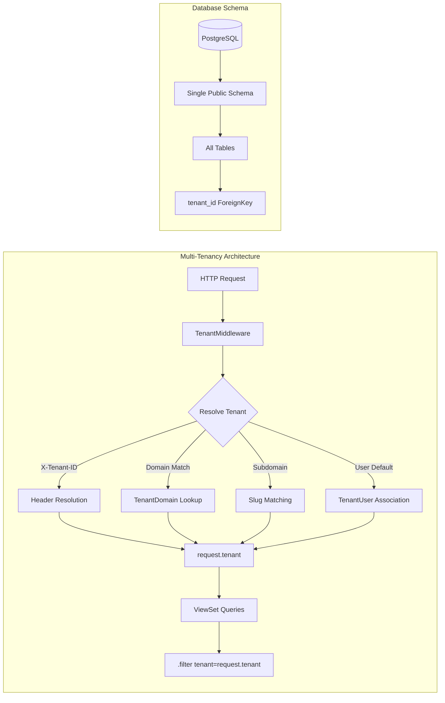

# ProjectMeats Architecture (Authoritative — December 2025)

> **IMPORTANT**: This document is the single source of truth for ProjectMeats architecture.
> If any other documentation contradicts this file, THIS FILE WINS.
> See `backend/projectmeats/settings/base.py` for implementation details.

## Multi-Tenancy: Shared Schema ONLY (ZERO SCHEMA ISOLATION)

**⚠️ ARCHITECTURE DECISION (December 2025):**
**ProjectMeats uses SHARED SCHEMA multi-tenancy EXCLUSIVELY. NO schema-based isolation is used or supported.**

### CURRENT ARCHITECTURE (Active and Enforced)

**Implementation Reference:** `backend/projectmeats/settings/base.py` lines 1-87

#### Core Architecture Principles

1. **Single PostgreSQL Schema**
   - ALL tenants share the SAME PostgreSQL `public` schema
   - NO separate schemas per tenant
   - NO schema routing or switching logic
   - Data isolation via `tenant_id` ForeignKey ONLY

2. **Tenant Isolation Mechanism**
   - Business models have `tenant` ForeignKey to `apps.tenants.Tenant`
   - Custom `TenantMiddleware` resolves tenant from request context
   - ViewSets filter querysets: `queryset.filter(tenant=request.tenant)`
   - Standard Django migrations: `python manage.py migrate`

3. **Middleware Configuration**
   ```python
   # From backend/projectmeats/settings/base.py
   MIDDLEWARE = [
       "corsheaders.middleware.CorsMiddleware",
       "apps.tenants.middleware.TenantMiddleware",  # Custom shared-schema resolver
       "django.middleware.security.SecurityMiddleware",
       # ... other middleware
   ]
   ```

4. **Application Structure**
   ```python
   # From backend/projectmeats/settings/base.py
   INSTALLED_APPS = (
       _DJANGO_CORE_APPS +
       ["django.contrib.staticfiles"] +
       _THIRD_PARTY_APPS +  # NO django-tenants included
       _PROJECT_APPS        # All apps in shared schema
   )
   ```

5. **Row-Level Security Flag**
   ```python
   # From backend/projectmeats/settings/base.py
   ROW_LEVEL_SECURITY = True  # For auditing/future PostgreSQL RLS
   ```



### Key Principles

1. **Single Schema**: All tenants share one PostgreSQL schema (`public`)
2. **ForeignKey Isolation**: Business models use `tenant` ForeignKey for data isolation
3. **Middleware Resolution**: `TenantMiddleware` sets `request.tenant` from domain/header/user
4. **ViewSet Filtering**: All ViewSets filter querysets by `tenant=request.tenant`

### What Was Removed (DEPRECATED - NEVER USE)

**🚫 The following patterns are STRICTLY PROHIBITED:**
- ❌ `django-tenants` package dependency
- ❌ `Client` and `Domain` models (TenantMixin/DomainMixin)
- ❌ Schema-based routing and `migrate_schemas` commands
- ❌ `TENANT_MODEL`, `TENANT_DOMAIN_MODEL`, `DATABASE_ROUTERS` settings
- ❌ PostgreSQL schema switching or `schema_context()` usage
- ❌ Any form of schema-per-tenant architecture

**📜 Why Schema Isolation Was Abandoned:**
1. **AI Scalability**: Single schema simplifies RAG/vector search and AI indexing
2. **Operational Simplicity**: Standard Django migrations without schema complexity
3. **Performance**: Eliminated schema switching overhead (20-50ms per request)
4. **Maintenance**: Easier backup/restore and database operations
5. **Developer Experience**: Simpler mental model and debugging

**⚠️ Historical Archive Notice:** 
Files in `docs/archive/legacy_2025/` reference the REJECTED schema-based design. These are explicitly excluded from AI indexing via `.cursorignore` and `.copilotignore`. DO NOT reference them for current implementation.

### What Remains

- ✅ `Tenant` model for tenant metadata
- ✅ `TenantUser` for user-tenant associations with roles
- ✅ `TenantDomain` for custom domain routing
- ✅ `TenantInvitation` for invite-only signup
- ✅ Custom `TenantMiddleware` for shared-schema resolution

## Tech Stack

| Layer | Technology | Version |
|-------|------------|---------|
| Backend | Django + DRF | 5.x |
| Database | PostgreSQL | 15+ |
| Frontend | React + TypeScript | 19 + 5.9 |
| Build Tool | react-app-rewired (migrating to Vite) | 5.x |
| UI Components | dnd-kit, TanStack Query | Latest |
| Styling | Tailwind CSS | 3.x |

## Directory Structure

```
/backend/
  manage.py
  projectmeats/
    settings/
      base.py         # Shared settings
      development.py  # Dev overrides
      production.py   # Prod overrides
  apps/
    core/             # Shared utilities
    tenants/          # Tenant management
  tenant_apps/        # Business logic apps

/frontend/
  src/
    features/         # Feature-sliced layout
    components/       # Reusable components
    hooks/            # Custom React hooks
    services/         # API clients

/deploy/
  nginx/              # Nginx configuration
```

## Golden Rules (MANDATORY COMPLIANCE)

1. **Never use django-tenants** - All multi-tenancy is via tenant_id ForeignKeys (ZERO schema isolation) ✅ ENFORCED
2. **Always filter by tenant** - ViewSets MUST filter querysets with `tenant=request.tenant` ✅ ENFORCED
3. **Use standard migrate** - ONLY use `python manage.py migrate` (NO schema-based commands) ✅ ENFORCED
4. **API via unified ingress** - All API calls go through `/api/v1/` ✅ ENFORCED
5. **Vite-ready code** - Write frontend code compatible with Vite patterns (migration in progress) 🔄 IN PROGRESS

## Migration Commands

```bash
# Standard Django migrations (no schema-based commands)
python manage.py makemigrations
python manage.py migrate

# Check for unapplied migrations
python manage.py makemigrations --check
```

## API Design

- **Base URL**: `/api/v1/`
- **Authentication**: Token + Session
- **Tenant Header**: `X-Tenant-ID` (optional, for explicit tenant selection)

---

**Last Updated**: December 2025 | **Version**: 2.0 (Shared Schema Only)
