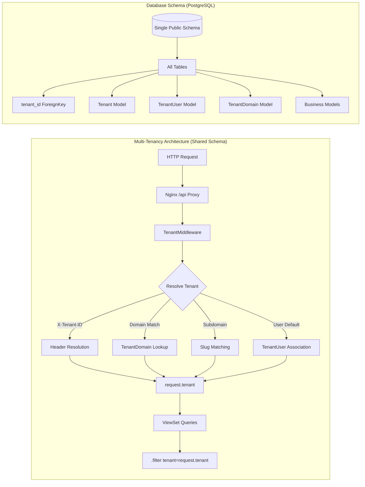

# ProjectMeats Architecture (Authoritative — December 2025)

> **IMPORTANT**: This document is the single source of truth for ProjectMeats architecture.
> If any other documentation contradicts this file, THIS FILE WINS.

## Multi-Tenancy: Shared Schema Only

**ProjectMeats uses SHARED SCHEMA multi-tenancy. There is NO django-tenants schema-based isolation.**

### Refactor Summary (December 2025)

This architecture represents the **ideal state** after purging hybrid multi-tenancy debt:

- ✅ Removed `django-tenants` package dependency
- ✅ Dropped legacy `Client` and `Domain` models (schema-based)
- ✅ Removed `schema_name` field from `Tenant` model
- ✅ Unified ingress: All API traffic via `/api` proxy to backend
- ✅ Updated all docs to reflect shared-schema-only approach



### Key Principles

1. **Single Schema**: All tenants share one PostgreSQL schema (`public`)
2. **ForeignKey Isolation**: Business models use `tenant` ForeignKey for data isolation
3. **Middleware Resolution**: `TenantMiddleware` sets `request.tenant` from domain/header/user
4. **ViewSet Filtering**: All ViewSets filter querysets by `tenant=request.tenant`
5. **Unified Ingress**: All API requests go through Nginx `/api` proxy (same domain)

### What Was Removed (December 2025 Refactor)

- ❌ `django-tenants` package dependency
- ❌ `Client` and `Domain` models (TenantMixin/DomainMixin)
- ❌ `schema_name` field from Tenant model
- ❌ Schema-based routing and `migrate_schemas` commands
- ❌ `TENANT_MODEL`, `TENANT_DOMAIN_MODEL`, `DATABASE_ROUTERS` settings
- ❌ Split DNS for frontend/backend (now unified via `/api`)

### What Remains

- ✅ `Tenant` model for tenant metadata
- ✅ `TenantUser` for user-tenant associations with roles
- ✅ `TenantDomain` for custom domain routing
- ✅ `TenantInvitation` for invite-only signup
- ✅ Custom `TenantMiddleware` for shared-schema resolution

## Tech Stack

| Layer | Technology | Version |
|-------|------------|---------|
| Backend | Django + DRF | 5.x → 6.0 (roadmap) |
| Database | PostgreSQL | 15+ |
| Frontend | React + TypeScript | 19.2.1 + 5.9 |
| Build Tool | Vite | 5.x |
| UI Components | dnd-kit, TanStack Query | Latest |
| Styling | Tailwind CSS | 3.x |
| Monorepo (future) | Nx | Planned |

## Directory Structure

```
/backend/
  manage.py
  projectmeats/
    settings/
      base.py         # Shared settings
      development.py  # Dev overrides (no django-tenants)
      production.py   # Prod overrides
  apps/
    core/             # Shared utilities
    tenants/          # Tenant management (shared-schema)
  tenant_apps/        # Business logic apps

/frontend/
  src/
    features/         # Feature-sliced layout
    components/       # Reusable components
    hooks/            # Custom React hooks
    services/         # API clients (API_BASE_URL=/api/v1)

/deploy/
  nginx/
    frontend.conf     # Unified ingress (/api proxy)

/docs/
  ARCHITECTURE.md     # This file (authoritative)
  archive/            # Deprecated guides
```

## Golden Rules

1. **Never use django-tenants** - All multi-tenancy is via tenant_id ForeignKeys
2. **Always filter by tenant** - ViewSets must filter querysets with `tenant=request.tenant`
3. **Use standard migrate** - No `migrate_schemas` commands needed
4. **API via unified ingress** - All API calls go through `/api/v1/` (same domain as frontend)
5. **Ethical AI** - Follow responsible AI guidelines (see .github/copilot-instructions.md)

## Migration Commands

```bash
# Standard Django migrations (no schema-based commands)
python manage.py makemigrations
python manage.py migrate

# Check for unapplied migrations
python manage.py makemigrations --check
```

## API Design

- **Base URL**: `/api/v1/`
- **Authentication**: Token + Session
- **Tenant Header**: `X-Tenant-ID` (optional, for explicit tenant selection)

---

**Last Updated**: December 2025 | **Version**: 2.0 (Shared Schema Only)
