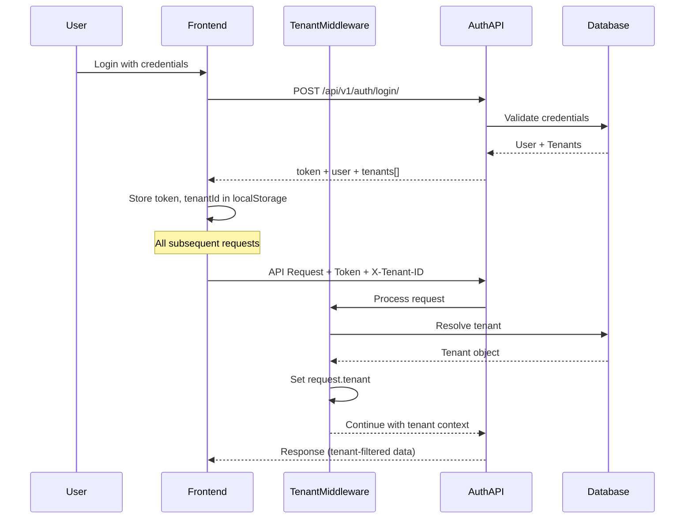

# Multi-Tenant Authentication Flow Guide

## Overview

ProjectMeats implements a unified authentication flow that supports multi-tenancy through tenant context resolution via domain, subdomain, or explicit X-Tenant-ID headers. This guide documents the complete authentication flow and integration between frontend and backend.

## Architecture



## Frontend Implementation

### Authentication Service

**Location**: `frontend/src/services/authService.ts`

#### Login Flow

```typescript
// 1. User provides credentials
const credentials = {
  username: 'user@example.com',
  password: 'secure_password'
};

// 2. Call login endpoint
const response = await authService.login(credentials);

// 3. Store authentication state
// - authToken (stored in localStorage)
// - user profile (stored in localStorage)
// - tenantId, tenantName, tenantSlug (primary tenant)

// 4. All subsequent API calls automatically include:
// - Authorization: Token {authToken}
// - X-Tenant-ID: {tenantId}
```

#### Sign Up Flow

```typescript
// 1. User provides registration data
const credentials = {
  username: 'newuser',
  email: 'user@example.com',
  password: 'secure_password',
  firstName: 'John',
  lastName: 'Doe'
};

// 2. Call signup endpoint
const response = await authService.signUp(credentials);

// 3. Store authentication state (same as login)
```

### API Service with Tenant Context

**Location**: `frontend/src/services/apiService.ts`

The API service automatically adds tenant context to all requests:

```typescript
// Request interceptor
apiClient.interceptors.request.use((config) => {
  // Add authentication token
  const token = localStorage.getItem('authToken');
  if (token) {
    config.headers.Authorization = `Token ${token}`;
  }
  
  // Add tenant ID header (CRITICAL for multi-tenancy)
  const tenantId = localStorage.getItem('tenantId');
  if (tenantId) {
    config.headers['X-Tenant-ID'] = tenantId;
  }
  
  return config;
});
```

### Tenant Resolution Priority

Frontend provides tenant context via:
1. **X-Tenant-ID header** (explicit tenant selection)
2. **Domain/subdomain** (automatic tenant resolution by middleware)

Backend TenantMiddleware resolution order:
1. X-Tenant-ID header (highest priority)
2. Full domain match via TenantDomain
3. Subdomain matching (tenant.slug)
4. User's default tenant (fallback)

## Backend Implementation

### Tenant Middleware

**Location**: `backend/apps/tenants/middleware.py`

The middleware sets `request.tenant` for every request:

```python
class TenantMiddleware:
    def __call__(self, request):
        tenant = None
        
        # 1. Try X-Tenant-ID header (explicit)
        tenant_id = request.headers.get("X-Tenant-ID")
        if tenant_id:
            tenant = Tenant.objects.get(id=tenant_id, is_active=True)
            # Verify user has access to this tenant
            if not request.user.is_superuser:
                if not TenantUser.objects.filter(
                    user=request.user, tenant=tenant, is_active=True
                ).exists():
                    return HttpResponseForbidden("You do not have access to this tenant")
        
        # 2. Try domain match
        if not tenant:
            host = request.get_host().split(":")[0]
            domain_obj = TenantDomain.objects.get(domain=host)
            tenant = domain_obj.tenant
        
        # 3. Try subdomain
        if not tenant:
            subdomain = host.split(".")[0]
            tenant = Tenant.objects.get(slug=subdomain, is_active=True)
        
        # 4. Use user's default tenant
        if not tenant and request.user.is_authenticated:
            tenant_user = TenantUser.objects.filter(
                user=request.user, is_active=True
            ).first()
            tenant = tenant_user.tenant
        
        # Set tenant in request
        request.tenant = tenant
        
        # Set PostgreSQL session variable for RLS
        if tenant:
            with connection.cursor() as cursor:
                cursor.execute(
                    "SELECT set_config('app.current_tenant_id', %s, false)",
                    [str(tenant.id)]
                )
        
        return self.get_response(request)
```

### Authentication Endpoints

**Location**: `backend/apps/tenants/views.py` (or auth app)

#### Login Endpoint

```python
@api_view(['POST'])
def login(request):
    username = request.data.get('username')
    password = request.data.get('password')
    
    user = authenticate(username=username, password=password)
    if not user:
        return Response({'error': 'Invalid credentials'}, status=401)
    
    # Get user's tenants
    tenant_users = TenantUser.objects.filter(user=user, is_active=True)
    tenants = [{
        'tenant__id': str(tu.tenant.id),
        'tenant__name': tu.tenant.name,
        'tenant__slug': tu.tenant.slug,
        'role': tu.role
    } for tu in tenant_users]
    
    # Create or get token
    token, created = Token.objects.get_or_create(user=user)
    
    return Response({
        'token': token.key,
        'user': {
            'id': user.id,
            'username': user.username,
            'email': user.email,
            'first_name': user.first_name,
            'last_name': user.last_name,
            'is_staff': user.is_staff,
            'is_superuser': user.is_superuser,
        },
        'tenants': tenants
    })
```

### ViewSet with Tenant Filtering

**Location**: All business app ViewSets

```python
class SupplierViewSet(viewsets.ModelViewSet):
    queryset = Supplier.objects.all()
    serializer_class = SupplierSerializer
    permission_classes = [IsAuthenticated]
    
    def get_queryset(self):
        # ALWAYS filter by tenant
        if not self.request.tenant:
            return Supplier.objects.none()
        return super().get_queryset().filter(tenant=self.request.tenant)
    
    def perform_create(self, serializer):
        # ALWAYS set tenant on creation
        serializer.save(tenant=self.request.tenant)
```

## Domain-Based Tenant Routing

### Configuration

**Model**: `TenantDomain`

```python
class TenantDomain(models.Model):
    tenant = models.ForeignKey(Tenant, on_delete=models.CASCADE)
    domain = models.CharField(max_length=255, unique=True)
    is_primary = models.BooleanField(default=False)
```

### Examples

1. **Custom Domain**:
   - Domain: `acme.projectmeats.com`
   - Tenant: Acme Corporation
   - Resolution: Middleware matches full domain

2. **Subdomain**:
   - Domain: `acme.meatscentral.com`
   - Tenant: Acme Corporation (slug='acme')
   - Resolution: Middleware extracts subdomain and matches slug

3. **Explicit Selection**:
   - Header: `X-Tenant-ID: uuid`
   - Tenant: Any tenant user has access to
   - Resolution: Middleware uses header value directly

## Security Considerations

### Tenant Access Control

1. **Header Validation**: When X-Tenant-ID is provided, middleware verifies user has TenantUser association
2. **403 Forbidden**: Returned if user tries to access unauthorized tenant
3. **Superuser Override**: Superusers can access any tenant (for admin purposes)

### Token Security

1. **Token Storage**: Stored in localStorage (consider httpOnly cookies for enhanced security)
2. **Token Expiration**: Implement token expiration and refresh logic
3. **HTTPS Only**: Always use HTTPS in production

### Cross-Tenant Data Leakage Prevention

1. **ORM Filtering**: Always filter by `tenant=request.tenant`
2. **ViewSet Enforcement**: Override `get_queryset()` and `perform_create()`
3. **PostgreSQL RLS**: Database-level enforcement as additional layer
4. **Test Coverage**: Write tests to verify tenant isolation

## Testing

### Frontend Tests

**Location**: `frontend/src/services/authService.test.ts`

```typescript
describe('AuthService', () => {
  test('login stores tenant information', async () => {
    const response = await authService.login({
      username: 'test',
      password: 'pass'
    });
    
    expect(localStorage.getItem('authToken')).toBeDefined();
    expect(localStorage.getItem('tenantId')).toBeDefined();
    expect(localStorage.getItem('tenantName')).toBeDefined();
  });
  
  test('API calls include X-Tenant-ID header', async () => {
    localStorage.setItem('tenantId', 'test-tenant-id');
    
    const suppliers = await apiService.getSuppliers();
    
    // Verify request included X-Tenant-ID header
    expect(mockAxios.get).toHaveBeenCalledWith(
      '/suppliers/',
      expect.objectContaining({
        headers: expect.objectContaining({
          'X-Tenant-ID': 'test-tenant-id'
        })
      })
    );
  });
});
```

### Backend Tests

**Location**: `backend/apps/tenants/tests_auth_flow.py`

```python
class AuthFlowTestCase(TestCase):
    def test_login_returns_tenants(self):
        user = User.objects.create_user(username='test', password='pass')
        tenant = Tenant.objects.create(name='Test', slug='test')
        TenantUser.objects.create(user=user, tenant=tenant, role='admin')
        
        response = self.client.post('/api/v1/auth/login/', {
            'username': 'test',
            'password': 'pass'
        })
        
        self.assertEqual(response.status_code, 200)
        self.assertIn('token', response.data)
        self.assertIn('tenants', response.data)
        self.assertEqual(len(response.data['tenants']), 1)
    
    def test_x_tenant_id_header_enforces_tenant(self):
        user = User.objects.create_user(username='test', password='pass')
        tenant1 = Tenant.objects.create(name='Tenant 1', slug='tenant1')
        tenant2 = Tenant.objects.create(name='Tenant 2', slug='tenant2')
        TenantUser.objects.create(user=user, tenant=tenant1, role='admin')
        
        # Create suppliers for both tenants
        Supplier.objects.create(tenant=tenant1, name='Supplier 1')
        Supplier.objects.create(tenant=tenant2, name='Supplier 2')
        
        # Login
        response = self.client.post('/api/v1/auth/login/', {
            'username': 'test',
            'password': 'pass'
        })
        token = response.data['token']
        
        # Request with tenant1 header - should only see tenant1 data
        response = self.client.get('/api/v1/suppliers/', 
            HTTP_AUTHORIZATION=f'Token {token}',
            HTTP_X_TENANT_ID=str(tenant1.id)
        )
        self.assertEqual(response.status_code, 200)
        self.assertEqual(len(response.data['results']), 1)
        self.assertEqual(response.data['results'][0]['name'], 'Supplier 1')
        
        # Request with tenant2 header - should be forbidden
        response = self.client.get('/api/v1/suppliers/',
            HTTP_AUTHORIZATION=f'Token {token}',
            HTTP_X_TENANT_ID=str(tenant2.id)
        )
        self.assertEqual(response.status_code, 403)
```

## Common Issues

### Issue: 403 Forbidden on API Calls

**Cause**: User doesn't have TenantUser association with requested tenant

**Solution**:
1. Verify user has TenantUser entry for the tenant
2. Check `is_active=True` on TenantUser
3. Use tenant from login response

### Issue: Wrong Tenant Data Returned

**Cause**: X-Tenant-ID header not being sent or incorrect tenantId in localStorage

**Solution**:
1. Check browser localStorage for tenantId
2. Verify API interceptor is adding header
3. Check network tab for X-Tenant-ID in request headers

### Issue: No Tenant Resolved

**Cause**: No tenant matches domain/subdomain and no X-Tenant-ID header

**Solution**:
1. Create TenantDomain entry for the domain
2. Ensure tenant slug matches subdomain
3. Provide X-Tenant-ID header explicitly

## Best Practices

1. **Always use X-Tenant-ID**: Explicitly pass tenant ID in headers for clarity
2. **Test tenant isolation**: Write tests to verify cross-tenant data leakage prevention
3. **Validate tenant access**: Check TenantUser association before granting access
4. **Log tenant context**: Include tenant info in logs for debugging
5. **Monitor unauthorized access**: Alert on 403 errors
6. **Use HTTPS**: Protect tokens and tenant information in transit
7. **Implement token refresh**: Prevent long-lived tokens
8. **Audit tenant switches**: Log when users switch between tenants

## Migration Guide

### From Other Multi-Tenancy Patterns

If migrating from django-tenants or other schema-based approaches:

1. **Remove schema context**: No `schema_context()` or `connection.schema_name`
2. **Add tenant ForeignKey**: All business models need `tenant` field
3. **Update ViewSets**: Override `get_queryset()` and `perform_create()`
4. **Update middleware**: Use shared-schema TenantMiddleware
5. **Update migrations**: Use standard `python manage.py migrate`
6. **Update tests**: Remove schema-based test patterns

## References

- [Middleware Documentation](../backend/apps/tenants/middleware.py)
- [API Service](../frontend/src/services/apiService.ts)
- [Auth Service](../frontend/src/services/authService.ts)
- [Architecture Guide](ARCHITECTURE.md)
